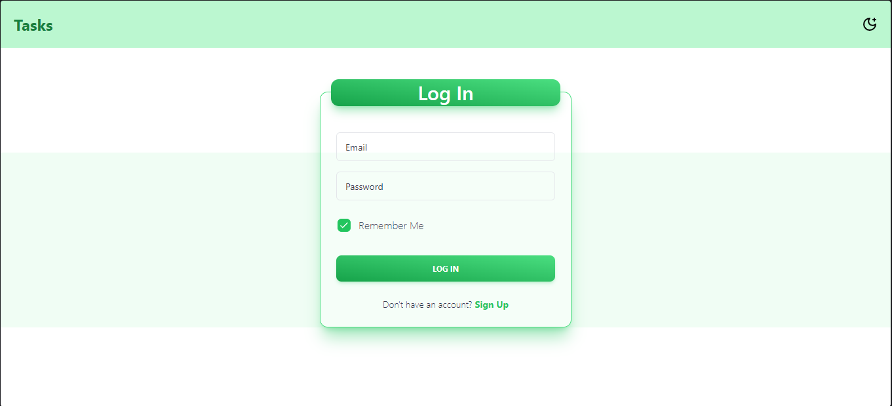
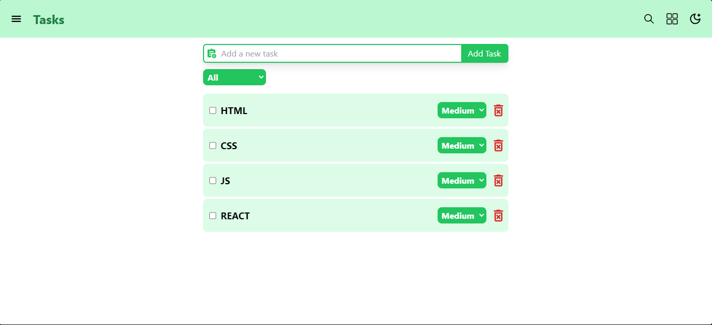
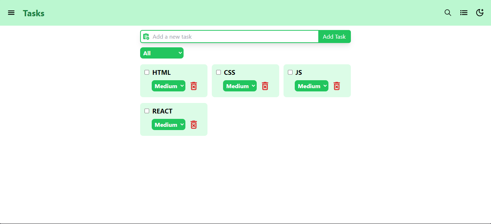
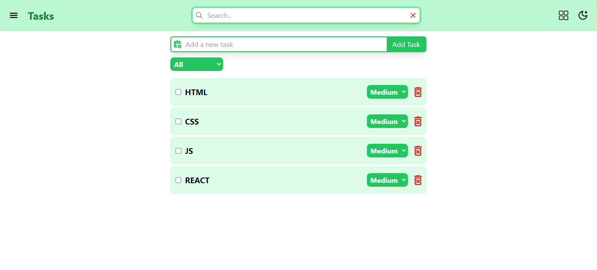
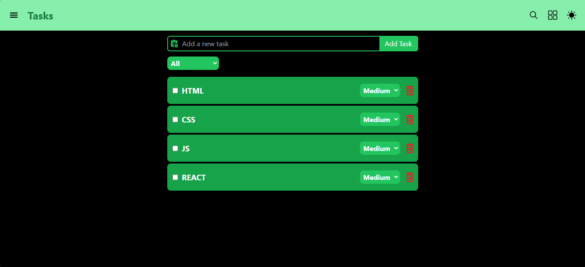
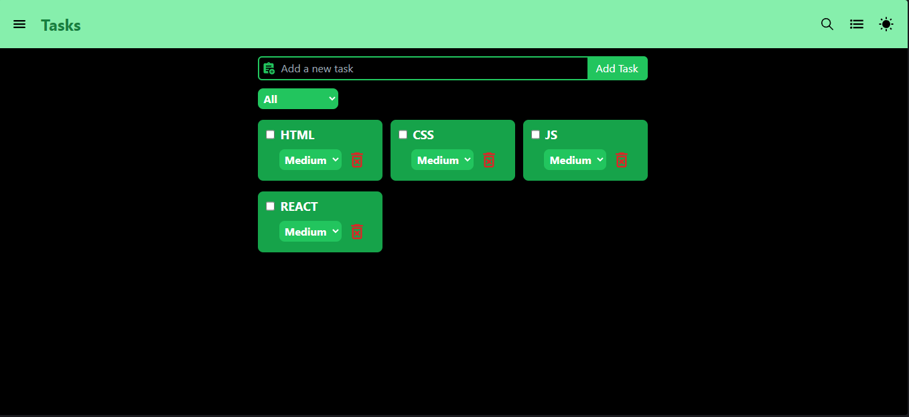
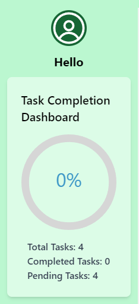
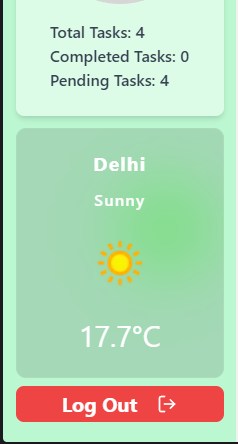
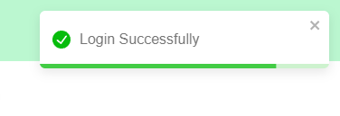

# To-Do App 📝

A simple and responsive to-do list application built with React and Redux Toolkit, featuring task prioritization, persistent storage, and user authentication.

## Features

- **Add Tasks**: Easily add tasks to your to-do list with a simple input field.
- **View Tasks**: Displays all tasks with their priority (High, Medium, Low).
- **Delete Tasks**: Remove tasks with a single click.
- **Task Prioritization**: Set priority levels for tasks (High, Medium, Low).
- **Mark as Completed**: Mark tasks as completed and filter them.
- **Persistent Storage**: Tasks are saved using local storage to persist across sessions.
- **User Authentication**: Simulated login/logout functionality using Redux.
- **API Integration**: Integrated with a public API (e.g., weather API) to display relevant data for outdoor tasks.
- **Mobile-First Design**: Fully responsive and optimized for mobile, tablet, and desktop views.
- **Dark Mode**: Toggle between light and dark themes.

## Demo

Check out the live demo: [Live Demo Link](https://todosite124.netlify.app/)

## Screenshots
#### Light Mode





#### Dark Mode




#### Other Screenshots





## Getting Started

To run this project locally, follow these steps:

### Prerequisites

- Node.js installed (version 12 or above)
- npm or yarn installed

### Installation

1. Clone the repository:

   ```bash
   git https://github.com/a2istogether/todo.git
   cd todo
   ```

2. Install dependencies:

   ```bash
   npm install
   ```

   or if you use yarn:

   ```bash
   yarn install
   ```

3. Start the development server:

   ```bash
   npm run dev
   ```

   or:

   ```bash
   yarn run dev
   ```

4. Open your browser and navigate to `http://localhost:3000`.

## Usage

- **Add a Task**: Enter your task in the input field and press the "Add Task or Press Enter" button.
- **Set Task Priority**: Choose a priority level from the dropdown when adding or editing tasks.
- **Mark as Completed**: Click the checkbox next to a task to mark it as completed.
- **Delete a Task**: Click the delete icon next to the task you want to remove.
- **Login**: Use the simulated login feature to protect tasks behind authentication.

## Technologies Used

- **React**: Frontend framework for building the user interface.
- **Redux Toolkit**: For state management, including handling async actions.
- **Tailwind CSS**: For responsive and modern styling.
- **Axios**: For making API requests.
- **React-Icons**: For icons used in the app.

## API Integration

This app integrates with the **Weatherapi API** to display weather information for outdoor tasks. You can replace the API key in `src/components/WeatherInfo.jsx` to use your own.

```javascript
const API_KEY = 'your-openweather-api-key';
```

## Available Scripts

In the project directory, you can run:

### `npm start`

Runs the app in development mode.<br>
Open [http://localhost:3000](http://localhost:3000) to view it in the browser.

### `npm test`

Launches the test runner in interactive watch mode.

### `npm run build`

Builds the app for production to the `build` folder.<br>
It correctly bundles React in production mode and optimizes the build for the best performance.

## Contributing

Contributions are welcome! Feel free to open an issue or submit a pull request.

## License

This project is licensed under the MIT License - see the [LICENSE](LICENSE) file for details.

---

You can add more details depending on your app's specifics, like describing the state management in Redux or how the API integration works in detail. If you're deploying to a service like Netlify or Vercel, you could also add deployment instructions.
